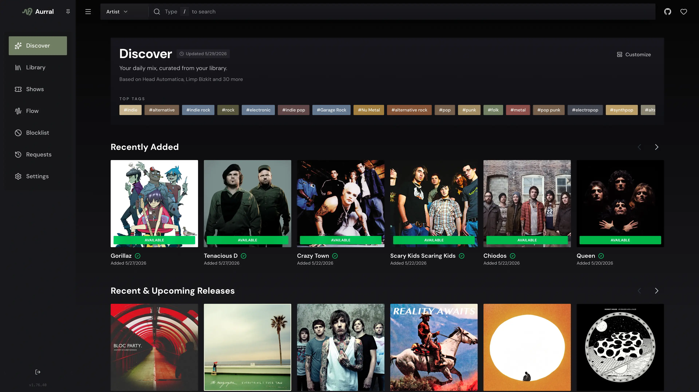
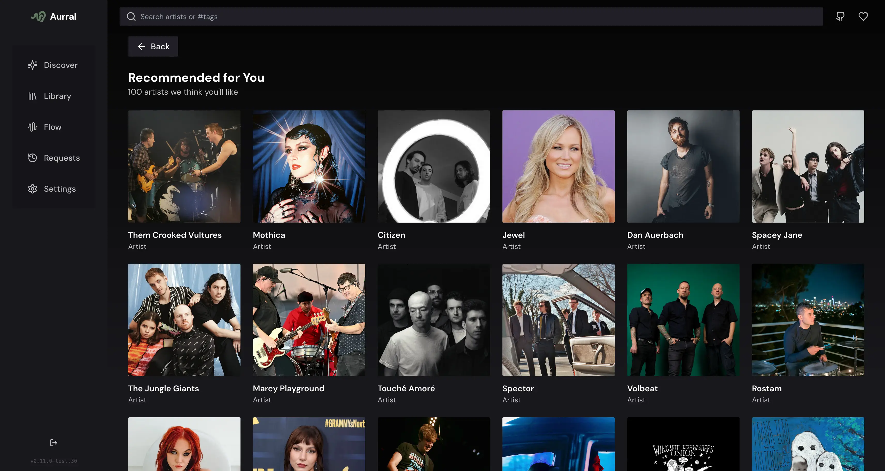
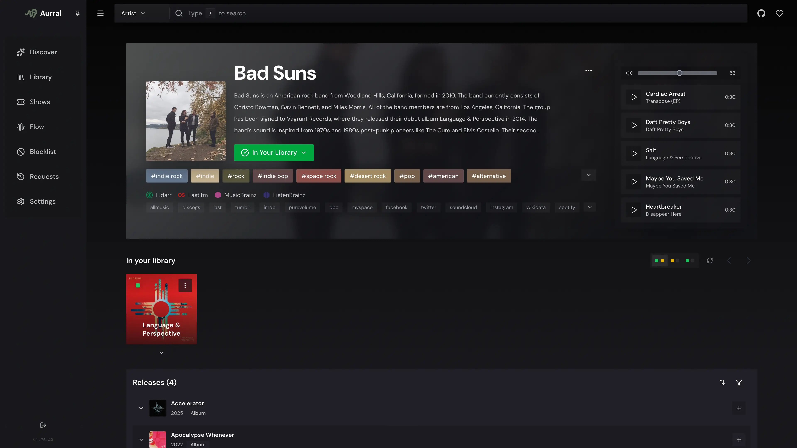

<div align="center" width="100%">
  
</div>

# Aurral

[](https://ghcr.io/lklynet/aurral)  
[](https://github.com/lklynet/aurral/actions/workflows/release.yml)  [](https://github.com/lklynet/aurral/discussions) 

Self-hosted music discovery, request management, flows, and playlist importing for Lidarr with library-aware recommendations and Navidrome integration.

## Quick Links

- [Docker image](https://ghcr.io/lklynet/aurral)
- [Contributing guide](CONTRIBUTING.md)
- [Flows and Playlists guide](flows-and-playlists.md)
- [Spotify import helper](https://aurral.org/aurral-convert)
- [Discord community](https://discord.gg/cpPYfgVURJ)

---

## What Aurral Does

- Search for artists via MusicBrainz and add them to Lidarr with granular monitoring behavior
- Browse your library in a clean UI and jump into artist details quickly
- Discover artists using your library, tags, trends, and Last.fm data
- Track requests plus queue, download, and import progress
- Build scheduled flows and static playlists without writing directly into your main library

Aurral is designed to be safe for your collection. Main library changes go through Lidarr's API, while flows and imported playlists write into their own separate downloads area.

---

## Quick Start

Create a `docker-compose.yml`:

```yaml
services:
  aurral:
    image: ghcr.io/lklynet/aurral:latest
    restart: unless-stopped
    ports:
      - "3001:3001"
    environment:
      - DOWNLOAD_FOLDER=${DL_FOLDER:-./data/downloads}
    volumes:
      - ${DL_FOLDER:-./data/downloads}:/app/downloads
      - ${STORAGE:-./data}:/app/backend/data
```

You can optionally set `DL_FOLDER` and `STORAGE` in a `.env` file next to your compose file. If you leave them unset, Aurral uses `./data/downloads` and `./data`.

Start it:

```bash
docker compose up -d
```

Open `http://localhost:3001` and complete onboarding.

---

## Flows And Playlists

Flows are dynamic playlists that refresh on a schedule. Playlists are static tracklists imported from JSON or saved from an existing flow.

- Create multiple flows with custom size, source mix, focus filters, and scheduled update days/hours
- Export a generated flow to JSON, then re-import it later as a static playlist, or convert it directly in-app
- Import shared or hand-built JSON playlists
- Edit imported playlist names and tracklists directly inside the app
- Use Navidrome to expose the dedicated Aurral flow library and smart playlists
- Use the built-in Spotify import button or the [Spotify import helper](https://aurral.org/aurral-convert) to convert existing Spotify playlists into an Aurral-friendly JSON playlist

Relevant links:

- [Flows and Playlists guide](flows-and-playlists.md)
- [Spotify import helper](https://aurral.org/aurral-convert)
- [Exportify](https://exportify.net/)

---

## Feature Overview

### Discovery

- Daily Discover recommendations based on your library, tags, and trends

### Lidarr Management

- Add artists with granular monitor options: None, All, Future, Missing, Latest, First
- Add specific albums from release groups
- Review request history and queue state from the UI

### Flows

- Multiple scheduled flows with adjustable Discover, Mix, and Trending balance
- Weekly or custom-day refresh scheduling with per-flow timing
- Dedicated download output separate from your main music library
- Optional Navidrome smart playlists in the `Aurral Weekly Flow` library

### Imported Playlists

- Import exported Aurral playlists, single playlist objects, raw track arrays, or multi-playlist bundles
- Retry the exact imported tracks on failures instead of replacing them
- Pause or resume retry cycles for incomplete imported playlists
- Export static playlists back to JSON for sharing

---

<details>
<summary><strong>Requirements And Recommended Stack</strong></summary>

### Required

- Lidarr reachable from Aurral
- Last.fm API key for metadata, images, and recommendation lookups
- Last.fm or ListenBrainz account if you want listening-history-based discovery
- MusicBrainz contact email for the required User-Agent policy

### Recommended stack for new users

- Lidarr Nightly
- Tubifarry
- slskd
- Navidrome

### For flows and playlists

- A downloads directory mounted into the container
- Navidrome if you want library and smart playlist integration

</details>

<details>
<summary><strong>Screenshots</strong></summary>

<p align="center">
  
</p>

<p align="center">
  
  
</p>

</details>

<details>
<summary><strong>Data, Volumes, And Safety</strong></summary>

### Downloads and flow library

Mount a downloads folder for flows, imported playlists, and optional Navidrome integration.

- Container path: `/app/downloads`
- Flow output root: `/app/downloads/aurral-weekly-flow`
- Typical flow track path: `/app/downloads/aurral-weekly-flow/<flow-id>/<artist>/<album>/<track>`

### Main library safety

Aurral does not write to your root music folder directly. Main collection changes happen through Lidarr add, monitor, request, and import actions.

</details>

<details>
<summary><strong>Navidrome Setup</strong></summary>

If you want flows to appear as a separate library inside Navidrome:

1. In Aurral, go to `Settings -> Integrations -> Navidrome`
2. Ensure your compose config maps a host folder into `/app/downloads`
3. Set `DL_FOLDER` once and use it for both `DOWNLOAD_FOLDER` and the `/app/downloads` volume

Example:

- `DL_FOLDER=/data/downloads/tmp`
- Volume: `${DL_FOLDER}:/app/downloads`
- Env: `DOWNLOAD_FOLDER=${DL_FOLDER}`

Aurral will:

- Create a Navidrome library pointing to `<DOWNLOAD_FOLDER>/aurral-weekly-flow`
- Write smart playlist files (`.nsp`) into the weekly flow library folder

Navidrome should be configured to purge missing tracks so flow rotations do not leave stale entries:

- `ND_SCANNER_PURGEMISSING=always`
- `ND_SCANNER_PURGEMISSING=full`

</details>

<details>
<summary><strong>Authentication And Reverse Proxy</strong></summary>

### Local users

Aurral uses local user accounts created during onboarding. Authentication is HTTP Basic Auth at the API layer, so use HTTPS if you expose it publicly.

### Reset forgotten admin password

Set a specific password:

```bash
npm run auth:reset-admin-password -- --password "new-password"
```

Generate a random password:

```bash
npm run auth:reset-admin-password -- --generate
```

The `--` after `npm run auth:reset-admin-password` tells npm to pass the remaining flags to the reset script.

### Reverse-proxy auth

If you want SSO, place Aurral behind an auth-aware reverse proxy and forward the authenticated username in a header.

```bash
AUTH_PROXY_ENABLED=true
AUTH_PROXY_HEADER=X-Forwarded-User
AUTH_PROXY_TRUSTED_IPS=10.0.0.1,10.0.0.2
AUTH_PROXY_ADMIN_USERS=alice,bob
AUTH_PROXY_ROLE_HEADER=X-Forwarded-Role
AUTH_PROXY_DEFAULT_ROLE=user
```

### Trust proxy

If you are behind a reverse proxy, set:

```bash
TRUST_PROXY=true
```

</details>

<details>
<summary><strong>Environment Variables</strong></summary>

Most configuration is handled in the web UI, but these environment variables are still important.

| Variable | Purpose | Default |
|---|---|---|
| `PORT` | HTTP port | `3001` |
| `TRUST_PROXY` | Express trust proxy setting (`true`, `false`, or number) | `1` |
| `DOWNLOAD_FOLDER` | Flow root folder path used for Navidrome library creation | `${DL_FOLDER:-./data/downloads}` in the compose example |
| `PUID` / `PGID` | Run container as this UID and GID when starting as root | `1001` / `1001` |
| `LIDARR_INSECURE` | Allow invalid TLS certificates | unset |
| `LIDARR_TIMEOUT_MS` | Lidarr request timeout | `8000` |
| `SOULSEEK_USERNAME` / `SOULSEEK_PASSWORD` | Optional fixed Soulseek credentials | autogenerated if missing |
| `AUTH_PROXY_*` | Reverse-proxy auth options | unset |

</details>

<details>
<summary><strong>Notifications</strong></summary>

Aurral can send notifications via **Gotify** and **Webhooks** from `Settings -> Notifications`.

### Webhooks

For each webhook:

- No body sends a `GET` request
- A body sends a `POST` request with `Content-Type: application/json`
- Custom headers can be added per webhook

Body templates support two variables:

- `$flowPath` for the music directory, empty for discovery updates
- `$flowName` for the flow or playlist name

Example:

```json
{"src": "$flowPath", "playlist": "$flowName"}
```

Event triggers such as Discover updated and Weekly Flow done apply to all configured webhooks and are invoked sequentially in the order they are defined.

</details>

<details>
<summary><strong>Troubleshooting</strong></summary>

- Lidarr connection fails: confirm the Lidarr URL is reachable and the API key is correct in `Settings -> Integrations -> Lidarr`
- Discovery looks empty: add artists to Lidarr and configure Last.fm, then give the first recommendation refresh a little time
- MusicBrainz is slow: MusicBrainz is rate-limited and first runs can take longer
- Flows do not show in Navidrome: verify `DOWNLOAD_FOLDER` matches your host path mapping and Navidrome purge settings
- Permission errors writing `./data`: set `PUID` and `PGID` to match your host directory ownership

</details>

---

## Support

- Community and questions: [Discord](https://discord.gg/cpPYfgVURJ)
- Bugs and feature requests: [GitHub Issues](https://github.com/lklynet/aurral/issues)

<details>
<summary><strong>Star History</strong></summary>

<a href="https://www.star-history.com/?repos=lklynet%2Faurral&type=timeline&legend=bottom-right">
 <picture>
   <source media="(prefers-color-scheme: dark)" srcset="https://api.star-history.com/image?repos=lklynet/aurral&type=timeline&theme=dark&legend=top-left" />
   <source media="(prefers-color-scheme: light)" srcset="https://api.star-history.com/image?repos=lklynet/aurral&type=timeline&legend=top-left" />
   
 </picture>
</a>

</details>
