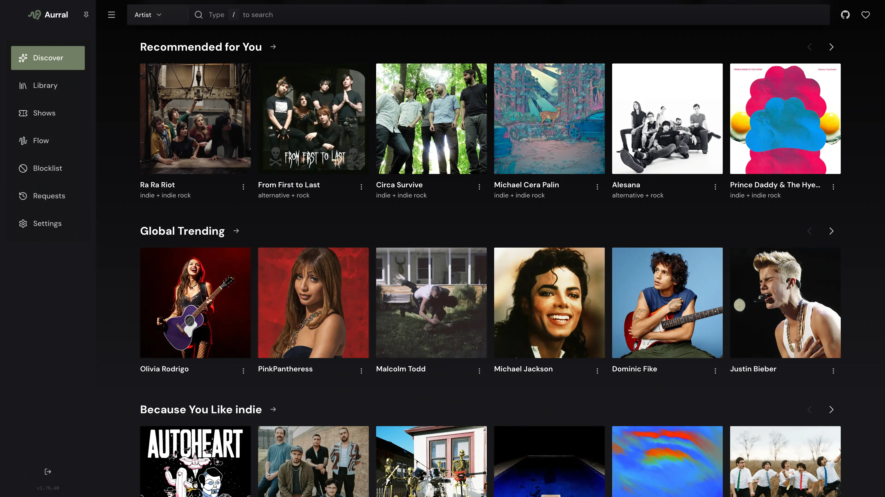

<div align="center" width="100%">
  
</div>

# Aurral

[](https://ghcr.io/lklynet/aurral)
[](https://github.com/lklynet/aurral/pkgs/container/aurral)


[](https://github.com/lklynet/aurral/actions/workflows/release.yml)

[](https://github.com/sponsors/lklynet/)

Aurral is a self-hosted music discovery app for the Lidarr stack. Find new artists, request albums, run scheduled flows, import playlists, and follow everything from recommendation to playback — without writing generated files into your main library.

## Quick Links

- [Website](https://aurral.org)
- [Documentation](https://docs.aurral.org/)
- [Self-hosting guide](https://docs.aurral.org/guides/self-hosting/)
- [Docker image](https://ghcr.io/lklynet/aurral)
- [Discord](https://discord.gg/cpPYfgVURJ)

## Features

- **Discover** — Personalized recommendations, trends, tags, recent releases, discover playlists, and nearby shows.
- **Search** — Find artists and albums, preview tracks, and add to Lidarr with your defaults.
- **Library** — Browse and search artists already in Lidarr.
- **Playlists** — Run scheduled flows, adopt discover playlists like Release Radar, import static playlists, and convert flows to fixed tracklists.
- **History** — One timeline for Lidarr requests, slskd downloads, and Aurral playlist activity.
- **Integrations** — Lidarr, Last.fm, ListenBrainz, slskd, Navidrome, Ticketmaster, Gotify, and webhooks.
- **Playback** — Stream through Navidrome with generated libraries and M3U playlists in a dedicated folder.
- **Multi-user** — Per-user profiles, discovery layout, permissions, local auth, LAN auto-login, and reverse-proxy SSO.

## Screenshots

<p align="center">
  
</p>

<p align="center">
  
  
  
  
</p>

## Recommended Stack

Aurral only needs Lidarr to get started. It works best with the stack self-hosters already trust:

| App or service | Role |
| --- | --- |
| [Lidarr](https://github.com/Lidarr/Lidarr) | Library management, artist and album requests, queue status |
| [slskd](https://github.com/slskd/slskd) | Soulseek-backed downloads for flows and playlists |
| [Navidrome](https://www.navidrome.org) | Streaming and playback for generated playlists |

## Quick Start

Create a `docker-compose.yml`:

```yaml
services:
  aurral:
    image: ghcr.io/lklynet/aurral:latest
    restart: unless-stopped
    ports:
      - "3001:3001"
    environment:
      - PUID=${PUID:-1000}
      - PGID=${PGID:-1000}
    volumes:
      - ${MEDIA_ROOT:-/srv/media}:/data
      - ${CONFIG:-./config/aurral}:/config
```

Change `${MEDIA_ROOT:-/srv/media}` to the host path you use for media. For file reuse, slskd downloads, and generated playlists, mount the **same root directory** into Aurral, Lidarr, slskd, and Navidrome at the same container path (for example `/srv/media:/data`). See [shared storage](https://docs.aurral.org/getting-started/storage/).

```bash
docker compose up -d
```

Open `http://localhost:3001` and complete onboarding.

For a full stack with Lidarr, slskd, and Navidrome, see [`docker-compose.example.yml`](docker-compose.example.yml).

## Documentation

Full setup and usage guides live at [docs.aurral.org](https://docs.aurral.org/).

- [Documentation home](https://docs.aurral.org/)
- [Docker setup](https://docs.aurral.org/getting-started/docker/)
- [Shared storage](https://docs.aurral.org/getting-started/storage/)
- [First run](https://docs.aurral.org/getting-started/first-run/)
- [Self-hosting guide](https://docs.aurral.org/guides/self-hosting/)
- [Playlists](https://docs.aurral.org/using/playlists/)
- [Flows](https://docs.aurral.org/using/flows/)
- [Playlist imports](https://docs.aurral.org/using/playlist-imports/)
- [Troubleshooting](https://docs.aurral.org/admin/troubleshooting/)
- [Spotify import tool](https://aurral.org/aurral-convert.html)

## Support

Aurral builds on open metadata, listening data, and infrastructure from the projects below.

| Project | Contribution |
| --- | --- |
| [BrainzMash](https://github.com/statichum/brainzmash-hearring-aid) | Hosted artist and album metadata for discovery and search |
| [Honker](https://github.com/russellromney/honker) | Durable SQLite queues and background workers across Aurral |
| [Last.fm](https://www.last.fm) | Listening history, tags, and personalized recommendations |
| [MusicBrainz](https://musicbrainz.org) | Canonical release metadata and artist identifiers |

- Community: [Discord](https://discord.gg/cpPYfgVURJ)
- Bugs and feature requests: [GitHub Issues](https://github.com/lklynet/aurral/issues)

## License

Aurral is released under the [MIT License](LICENSE).
