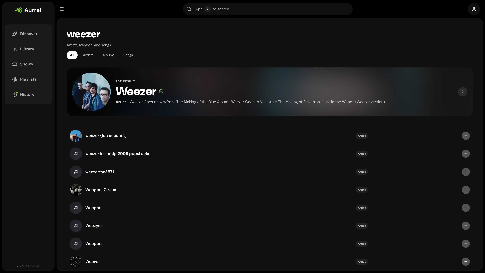
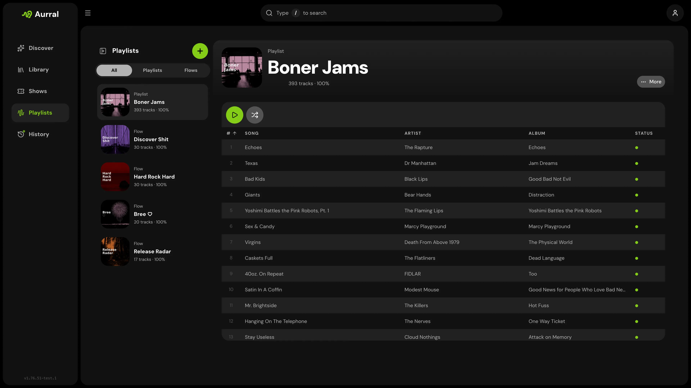

<div align="center" width="100%">
  
</div>

# Aurral

[](https://ghcr.io/lklynet/aurral)
[](https://github.com/lklynet/aurral/pkgs/container/aurral)


[](https://github.com/lklynet/aurral/actions/workflows/release.yml)

[](https://github.com/sponsors/lklynet/)

Aurral is the Lidarr companion for self-hosted music discovery. Best-in-class recommendations, rotating flows, and playlist downloads, built on Lidarr instead of replacing it. Expand the stack you already trust.

> [!NOTE]
> **[Aurral v2 is here.](V2.md)** Spotify import, yt-dlp and Usenet downloads, Plex sync, Gotify/webhook notifications, reverse-proxy auth, per-user discovery, and more.

> [!NOTE]
> **AI disclosure** - Aurral is built with a hybrid approach to development. The foundation is hand-written code. For feature work, specifications are written by a developer, and any AI-generated code is thoroughly reviewed before being merged.

## Quick Links

- [Website](https://aurral.org)
- [Documentation](https://docs.aurral.org/)
- [Discord](https://discord.gg/cpPYfgVURJ)

## Features

- **Discover**: Best-in-class personalized recommendations, trends, tags, recent releases, discover playlists, and nearby shows.
- **Search**: Find artists and albums, preview tracks, and add to Lidarr with your defaults.
- **Library**: Browse and search artists already in Lidarr.
- **Playlists**: Run scheduled flows, adopt discover playlists like Release Radar, import static playlists, and convert flows to fixed tracklists.
- **Activity**: Queue, review, and history for Lidarr requests, yt-dlp / slskd / Usenet downloads, and Aurral playlist jobs.
- **Integrations**: Lidarr, Last.fm, ListenBrainz, Koito, yt-dlp, slskd, SABnzbd/NZBGet, Navidrome, Plex, Ticketmaster, Gotify, and webhooks.
- **Playback**: Stream through Navidrome (M3U playlists) or Plex/Plexamp (API-synced playlists) from a dedicated download folder.
- **Multi-user**: Per-user profiles, discovery layout, permissions, local auth, LAN auto-login, and reverse-proxy SSO.

## Screenshots

<p align="center">
  
</p>

<p align="center">
  
  
  
  
</p>

## Recommended Stack

Aurral needs Lidarr. Everything else is optional. We build on the tools self-hosters already trust, rather than reinventing them:

| App or service                             | Role                                                        |
| ------------------------------------------ | ----------------------------------------------------------- |
| [Lidarr](https://github.com/Lidarr/Lidarr) | Library management, artist and album requests, queue status |
| [yt-dlp](https://github.com/yt-dlp/yt-dlp) | Built-in YouTube/web fallback for flows and playlists       |
| [slskd](https://github.com/slskd/slskd)    | Optional Soulseek-backed downloads for flows and playlists  |
| [Navidrome](https://www.navidrome.org)     | Streaming and playback via generated M3U playlists          |

## Quick Start

Create a `docker-compose.yml`:

```yaml
services:
  aurral:
    image: ghcr.io/lklynet/aurral:latest
    restart: unless-stopped
    ports:
      - "3001:3001"
    environment:
      - PUID=1000
      - PGID=1000
    volumes:
      - /data:/data
      - ./config:/config
```

Change `/data:/data` to the **same host media path Lidarr already mounts**. If Lidarr's stack works, Aurral's filesystem is already right. Then set the Downloads Folder path in the UI. See [Match Lidarr](https://docs.aurral.org/getting-started/storage/).

```bash
docker compose up -d
```

Open `http://localhost:3001`, create your admin account, and connect Lidarr.

For a full stack with Lidarr, slskd, and Navidrome or Plex, see [`docker-compose.example.yml`](docker-compose.example.yml). Plex setup: [docs](https://docs.aurral.org/integrations/plex/).

## macOS app

A native thin client for Apple Silicon Macs is available on [GitHub Releases](https://github.com/lklynet/aurral/releases). It connects to your self-hosted server. It does not replace Docker or another backend.

macOS may block the first launch because the app is not notarized yet. Control-click **Aurral → Open** in Applications, or run:

```bash
xattr -dr com.apple.quarantine /Applications/Aurral.app
```

See [macOS app](https://docs.aurral.org/getting-started/macos-app/) in the docs for install steps and details.

## Documentation

Full setup and usage guides live at [docs.aurral.org](https://docs.aurral.org/).

## Support

Aurral builds on open metadata, listening data, and infrastructure from the projects below.

| Project                                                            | Contribution                                               |
| ------------------------------------------------------------------ | ---------------------------------------------------------- |
| [BrainzMash](https://github.com/statichum/brainzmash-hearring-aid) | Hosted artist and album metadata for discovery and search  |
| [Honker](https://github.com/russellromney/honker)                  | Durable SQLite queues and background workers across Aurral |
| [Last.fm](https://www.last.fm)                                     | Listening history, tags, and personalized recommendations  |
| [MusicBrainz](https://musicbrainz.org)                             | Canonical release metadata and artist identifiers          |

- Community: [Discord](https://discord.gg/cpPYfgVURJ)
- Bugs and feature requests: [GitHub Issues](https://github.com/lklynet/aurral/issues)

## Sponsors


## License

Aurral is released under the [MIT License](LICENSE).
