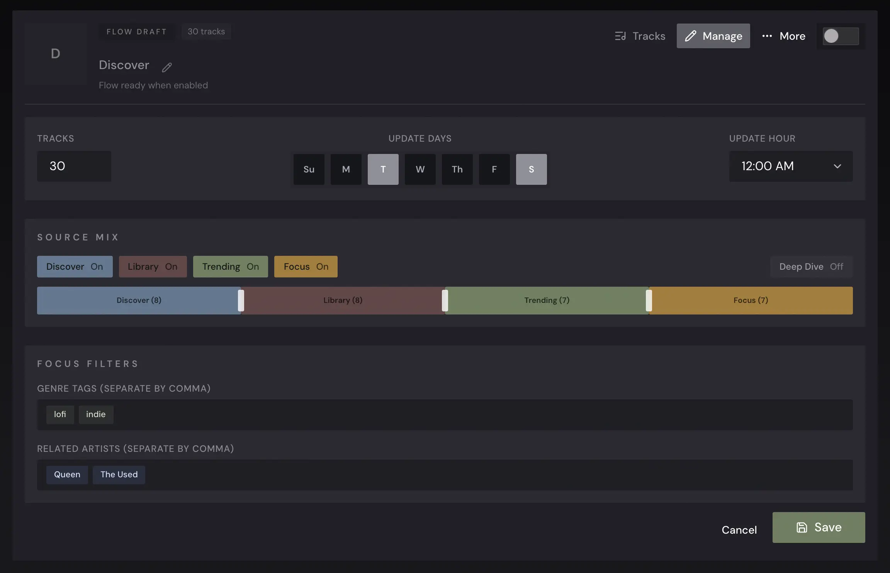

<div align="center" width="100%">
  
</div>

# Aurral

[](https://ghcr.io/lklynet/aurral)


[](https://github.com/lklynet/aurral/actions/workflows/release.yml)


Aurral is a self-hosted music discovery app for Lidarr users. It helps you find new artists, request albums, track queue progress, build scheduled discovery flows, import playlists, and keep all of that organized without dumping generated files into your main music library.

It is built for people who love discovering music and want that discovery loop to feel intentional, visual, and connected to the library they already maintain.

> [!WARNING]
> **Aurral v2 is coming.** The next major release is a big upgrade. Aurral's built-in Soulseek client is being removed in favor of external [slskd](https://github.com/slskd/slskd) for more reliable flow and playlist downloads. If you want to stay on the current 1.x line, pin your Docker image to a `1.x.x` tag instead of `latest` before updating. See [Pinning to Aurral 1.x](#pinning-to-aurral-1x).
>
> **[See what's new in v2.](https://github.com/lklynet/aurral/blob/test/V2.md)** Currently available on the `test` prerelease branch.

## Quick Links

- [Docker image](https://ghcr.io/lklynet/aurral)
- [Flows and Playlists guide](flows-and-playlists.md)
- [Spotify import helper](https://aurral.org/aurral-convert)
- [Discord community](https://discord.gg/cpPYfgVURJ)
- [Contributing guide](CONTRIBUTING.md)
- [Development notes](DEVELOPMENT.md)

## What Aurral Does

- Discovers artists from your library, listening history, tags, trends, and related artists.
- Searches artists and albums, then adds them to Lidarr with sane defaults.
- Shows request, download, queue, import, and failure status from Lidarr.
- Gives every user their own discovery account and preferences.
- Builds scheduled flows: dynamic playlists that refresh on your schedule.
- Imports static playlists from Aurral JSON, simple track lists, and Spotify-style exports.
- Downloads flow and playlist tracks into a dedicated Aurral folder.
- Reuses existing files by hardlink or copy when configured.
- Publishes generated flow libraries and smart playlists to Navidrome.
- Supports local users, permissions, optional local-network auto-login, and reverse-proxy auth.
- Sends Gotify notifications or custom webhooks when discovery or flows finish.

## Screenshots

<p align="center">
  
</p>

<p align="center">
  
  
</p>

## Recommended Stack

Aurral only needs Lidarr to get started, but it shines with a fuller music stack:

| App or service | What it unlocks                                                                           |
| -------------- | ----------------------------------------------------------------------------------------- |
| Lidarr         | Library management, artist and album adds, queue/history status, monitoring, and imports. |
| Last.fm        | Personalized recommendations, artist similarity, tags, genre search, and richer flows.    |
| ListenBrainz   | Optional listening-history source for users.                                              |
| Soulseek       | Downloads for flows and imported playlists.                                               |
| Navidrome      | Streaming and a separate Aurral flow library.                                             |
| Ticketmaster   | Local shows from artists Aurral thinks you may care about.                                |

Last.fm is recommended, not required. Without it, Aurral still has fallback discovery, but personalized recommendations and tag exploration are much stronger with a Last.fm API key.

## Quick Start

Create a `docker-compose.yml`:

```yaml
services:
  aurral:
    image: ghcr.io/lklynet/aurral:latest
    restart: unless-stopped
    ports:
      - "3001:3001"
    environment:
      - DOWNLOAD_FOLDER=${DL_FOLDER:-./data/downloads}
    volumes:
      - ${DL_FOLDER:-./data/downloads}:/app/downloads
      - ${STORAGE:-./data}:/app/backend/data
```

Start Aurral:

```bash
docker compose up -d
```

Open:

```text
http://localhost:3001
```

Then follow the onboarding flow.

### Optional Compose `.env`

You can keep your paths in a `.env` file next to `docker-compose.yml`:

```bash
DL_FOLDER=./data/downloads
STORAGE=./data
```

`STORAGE` keeps Aurral's database and settings. `DL_FOLDER` keeps generated flow and playlist files.

## Pinning to Aurral 1.x

Aurral v2 is in development. It removes the built-in Soulseek client and requires [slskd](https://github.com/slskd/slskd) for Soulseek-backed downloads.

If you are not ready for that change yet, pin your image to a specific 1.x release instead of `latest`:

```yaml
services:
  aurral:
    image: ghcr.io/lklynet/aurral:1.76.0
```

Browse [GitHub releases](https://github.com/lklynet/aurral/releases) for the current 1.x tag. Watchtower, Renovate, and similar auto-updaters will pull v2 if you leave the image on `latest`.

## First Run

Onboarding asks for:

1. An admin account
2. Lidarr URL and API key
3. Optional Navidrome connection
4. Optional Last.fm username and API key

After onboarding, use `Settings` to finish anything you skipped.

The most important first settings are:

- `Integrations -> Lidarr`: confirm quality profile, tag, monitoring, and search-on-add defaults.
- `Integrations -> Last.fm`: add an API key for better recommendations.
- `Integrations -> Subsonic / Navidrome`: connect Navidrome if you want flow playback there.
- `Account`: set your own Last.fm or ListenBrainz username.
- `Discover`: choose how often recommendations refresh and how adventurous they should be.

## Using The App

### Discover

Discover is Aurral's home screen. It brings together personalized recommendations, global trends, tags, recent releases, recently added artists, and local shows when Ticketmaster is configured.

Discovery is library-aware: Aurral tries to recommend artists you do not already have. You can block artists or tags, give feedback on recommendations, and reorder or hide Discover sections per user.

Discovery modes:

| Mode     | Best for                                   |
| -------- | ------------------------------------------ |
| Safer    | Familiar, high-confidence recommendations. |
| Balanced | A mix of familiar picks and exploration.   |
| Deeper   | More adventurous recommendations.          |

### Search And Artist Pages

Search helps you find artists and albums, then add them to Lidarr. Artist pages show library status, release groups, tags, similar artists, previews, and album actions.

When adding artists or albums, Aurral uses your Lidarr defaults unless you customize the add action.

### Library

Library is a fast visual browser for artists already in Lidarr. You can search, sort, open artist pages, and see which artists are monitored.

### Requests

Requests turns Lidarr queue and history into a friendlier status view. It helps you see what is processing, what failed, and what became available.

### Shows

When Ticketmaster is configured, Aurral can show nearby concerts for recommended, trending, and library-adjacent artists. You can use automatic location lookup or enter a ZIP/postal code.

### Blocklist

Blocklist keeps unwanted artists and tags out of discovery. Use it when recommendations keep drifting into music you know you do not want.

## Flows And Playlists

Flows are dynamic playlists that refresh on a schedule. Imported playlists are static tracklists that keep retrying the same tracks.

<p align="center">
  
</p>

Both download into Aurral's own folder:

```text
/app/downloads/aurral-weekly-flow
```

They do not write directly into your main music library.

### Flows

Each flow can control:

- Track count
- Update days and hour
- Source mix
- Deep Dive
- Focus tags
- Focus related artists
- Enabled or draft state

Flow sources:

| Source   | What it uses                                       |
| -------- | -------------------------------------------------- |
| Discover | Aurral recommendations, excluding library artists. |
| Library  | Artists already in your library.                   |
| Trending | Broader trending pools, excluding library artists. |
| Focus    | Tags and related artists you choose.               |

### Imported Playlists

Aurral accepts exported Aurral playlists, simple JSON track lists, playlist bundles, and Spotify-style JSON converted from playlist exports.

Minimum track shape:

```json
{
  "artistName": "Burial",
  "trackName": "Archangel"
}
```

For a deeper guide, including accepted JSON formats and flow source behavior, read [flows-and-playlists.md](flows-and-playlists.md).

## Navidrome Setup

If you want generated flows to appear in Navidrome:

1. Mount the same host download folder into Aurral at `/app/downloads`.
2. Set `DOWNLOAD_FOLDER` to that host path.
3. Configure Navidrome in `Settings -> Integrations -> Subsonic / Navidrome`.
4. Let Aurral create/update the `Aurral Weekly Flow` library and smart playlists.

Recommended Navidrome setting:

```bash
ND_SCANNER_PURGEMISSING=always
```

That helps Navidrome clean up old flow entries after rotations.

## File Reuse

Aurral can avoid redownloading tracks it already has or tracks Lidarr already has.

Worker setting:

| Mode     | Meaning                                                                       |
| -------- | ----------------------------------------------------------------------------- |
| Download | Always download a fresh copy into the Aurral flow library.                    |
| Hardlink | Reuse a matching Aurral or Lidarr file with a hardlink, falling back to copy. |
| Copy     | Copy a matching Aurral or Lidarr file into the playlist folder.               |

To reuse Lidarr files, Aurral must see Lidarr's root directory the same way Lidarr sees it. In Lidarr, find this at `Settings -> Media Management -> Root Folders -> Path`. If your Lidarr root folder is `/data`, mount that same host library path into Aurral as `/data`:

```yaml
services:
  aurral:
    volumes:
      - /srv/aurral/downloads:/app/downloads
      - /srv/music:/data:ro
```

## Users And Auth

Aurral creates a local admin account during onboarding. Admins can add users and choose permissions:

- Access flows and playlists
- Add artists
- Add albums
- Change monitoring
- Delete artists
- Delete albums

Aurral also supports:

- Optional local-network auto-login for single-admin home setups
- Reverse-proxy authentication for SSO setups
- Admin password reset from the command line

Reset an admin password:

```bash
npm run auth:reset-admin-password -- --password "new-password"
```

Generate a random admin password:

```bash
npm run auth:reset-admin-password -- --generate
```

## Environment Variables Most Users Might Touch

Most setup happens in the web UI. These are the deployment variables regular users are most likely to need:

| Variable                                  | Why you might set it                                                     |
| ----------------------------------------- | ------------------------------------------------------------------------ |
| `DOWNLOAD_FOLDER`                         | Host path Navidrome should use for the Aurral flow library.              |
| `PUID` / `PGID`                           | Run the container as the same user/group that owns your mounted folders. |
| `TRUST_PROXY`                             | Set when Aurral is behind a reverse proxy and needs correct client IPs.  |
| `AUTH_PROXY_*`                            | Use only if your reverse proxy handles login for Aurral.                 |
| `SOULSEEK_USERNAME` / `SOULSEEK_PASSWORD` | Optional fixed Soulseek credentials instead of generated/rotated ones.   |
| `AURRAL_VERBOSE_LOGS`                     | Turn on fuller server logs while troubleshooting.                        |

Example:

```yaml
environment:
  - PUID=1000
  - PGID=1000
  - DOWNLOAD_FOLDER=/srv/aurral/downloads
```

## Backups And Safety

Back up:

- `/app/backend/data`
- Your `/app/downloads` host folder if you want generated playlists to survive rebuilds
- Your compose file and `.env`

Aurral stores its database, settings, encrypted integration secrets, users, sessions, cache state, and flow jobs under `/app/backend/data`.

Main library safety:

- Aurral does not directly write into your root music library.
- Artist and album changes go through Lidarr.
- Flows and imported playlists stay in Aurral's generated-download area.

<details>
<summary><strong>Troubleshooting</strong></summary>

### Lidarr will not connect

- Use the URL Aurral can reach, not necessarily the URL your browser uses.
- In Docker, that is often `http://lidarr:8686` if both containers share a network.
- Confirm the API key in Lidarr.

### Discover is empty

- Make sure Lidarr is connected and has artists.
- Add a Last.fm API key for better discovery.
- Set your listening-history username in `Settings -> Account`.
- Run a manual refresh from `Settings -> Discover`.
- Check whether your blocklist is too broad.

### Flows are not downloading

- Check the Flow worker settings.
- Rotate or set Soulseek credentials.
- Try disabling strict format matching.
- Try MP3 if FLAC matches are scarce.
- Check the job states shown on the Flow page.

### Files do not appear in Navidrome

- Confirm `/app/downloads` is mounted to a real host folder.
- Confirm `DOWNLOAD_FOLDER` points to that host folder.
- Confirm Navidrome can read the same folder.
- Enable missing-track purging in Navidrome.

### Permission errors

- Make sure your mounted folders are writable by the container user.
- Set `PUID` and `PGID` to match your host folder owner.

### Need more logs

Set `AURRAL_VERBOSE_LOGS=true`, restart Aurral, then check container logs.

</details>

## Special Thanks

Special thanks to the BrainzMash team for the metadata work that helps make Aurral's artist and album discovery feel rich. Their open-source work is available at [statichum/brainzmash-hearring-aid](https://github.com/statichum/brainzmash-hearring-aid).

## Support And Contributing

- Community and questions: [Discord](https://discord.gg/cpPYfgVURJ)
- Bugs and feature requests: [GitHub Issues](https://github.com/lklynet/aurral/issues)
- Contributor workflow: [CONTRIBUTING.md](CONTRIBUTING.md)
- Local development: [DEVELOPMENT.md](DEVELOPMENT.md)

## License

Aurral is released under the [MIT License](LICENSE).

<details>
<summary><strong>Star History</strong></summary>

<a href="https://www.star-history.com/?repos=lklynet%2Faurral&type=timeline&legend=bottom-right">
 <picture>
   <source media="(prefers-color-scheme: dark)" srcset="https://api.star-history.com/image?repos=lklynet/aurral&type=timeline&theme=dark&legend=top-left" />
   <source media="(prefers-color-scheme: light)" srcset="https://api.star-history.com/image?repos=lklynet/aurral&type=timeline&legend=top-left" />
   
 </picture>
</a>

</details>
