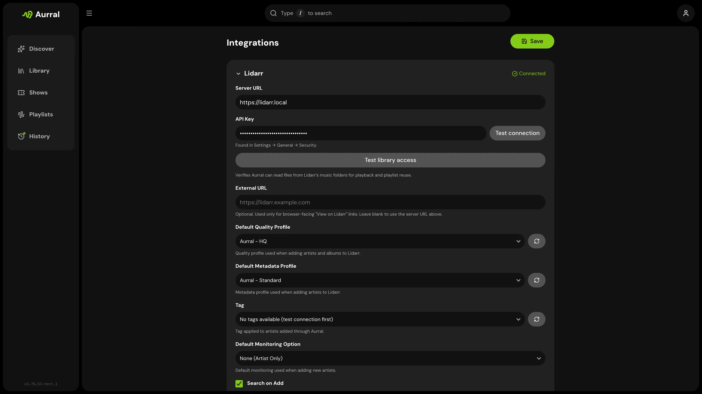

Lidarr is required. Aurral uses it to add artists and albums, read library state, and surface queue and history status.

## Connection

During onboarding or in **Settings → Library → Lidarr**, provide:

- The URL Aurral can reach (often `http://lidarr:8686` in Docker)
- Your Lidarr API key
- Default quality profile, metadata profile, tag, monitoring option, and search-on-add behavior
- Optional **Davo's Community Lidarr Guide** for discovery-friendly quality profiles and naming

## Library access check

Aurral tests that it can read files at the paths Lidarr reports. If this fails, confirm the shared `/data` mount described in [Shared storage](/getting-started/storage/).

On mixed Windows and Docker setups, **Test library access** shows the exact path Lidarr reports. If that folder is mounted at a different path inside Aurral, add a manual mapping under **Settings → Downloads → Advanced remote path mappings**. Aurral can then translate host paths such as `N:\Music\...` into mounted container paths such as `/music/Music/...`.

Path mappings apply to Aurral reading files. If Navidrome sees the same files at a different path, enable **Use Navidrome paths in M3U files** under **Settings → Playback → Navidrome** and add a Navidrome path mapping so M3U playlists use paths Navidrome can open. See [Navidrome](/integrations/navidrome/#mixed-windows-and-docker-navidrome).

## Safety

Artist and album changes go through Lidarr. Aurral does not write directly into your root music library.
