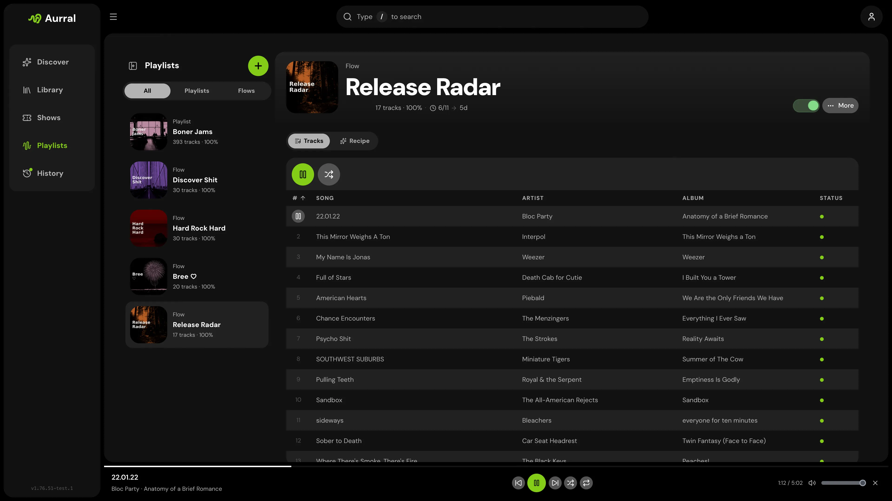

Navidrome is optional, but it is the cleanest way to play generated flows and imported playlists. Aurral can create a separate **aurral-weekly-flow** library and write generated M3U playlists for your flows and static playlists.



## Setup

1. Follow [Shared storage](/getting-started/storage/) so Navidrome can scan the same `DOWNLOAD_FOLDER` tree Aurral writes.
2. Connect Navidrome in **Settings → Playback → Navidrome**.
3. Let Aurral create or update its generated library and playlist files under `aurral-weekly-flow`.

## Mixed Windows and Docker Navidrome

Aurral writes M3U playlists under `aurral-weekly-flow` with one track path per line. Navidrome must be able to open those paths on **its** filesystem.

| Navidrome deployment                                                                                                 | Playlist path mode  | Setting                                                                                                               |
| -------------------------------------------------------------------------------------------------------------------- | ------------------- | --------------------------------------------------------------------------------------------------------------------- |
| Docker, same mounts as Aurral (for example `/data` or `/music`)                                                      | **local** (default) | Leave **Use Navidrome paths in M3U files** off                                                                        |
| Docker, different mount path than Aurral (for example Navidrome sees `/data/media/music` while Aurral sees `/music`) | **remote**          | Enable the Navidrome setting and add a Navidrome path mapping, or set `M3U_PATH_MODE=remote` plus `M3U_PATH_MAPPINGS` |
| Native Windows while Aurral is in Docker                                                                             | **remote**          | Enable the Navidrome setting and add a Navidrome path mapping, or set `M3U_PATH_MODE=remote` plus `M3U_PATH_MAPPINGS` |

### What remote mode does

With path mappings, Aurral translates Lidarr's Windows paths into container paths so it can read files—for example `N:\ServerFolders\Music\Music\Artist\track.mp3` becomes `/music/Music/Artist/track.mp3` inside Docker.

By default, generated M3U files use those **Aurral container paths**. Navidrome cannot resolve `/music/...` if it runs natively on Windows, or if its Docker container mounts the same files at a different path such as `/data/media/music`. In that case playlists may appear but tracks fail to play.

**Use Navidrome paths in M3U files** (or `M3U_PATH_MODE=remote`) changes paths **only when writing M3U files**:

- Explicit Navidrome mappings: Aurral maps the Aurral path to the Navidrome path (for example `/music/...` → `N:\ServerFolders\Music\...`)
- Reused tracks from native Windows Lidarr: Aurral can fall back to the original Lidarr path it received
- Legacy fallback: if no Navidrome mappings are configured, Aurral can still invert `PATH_MAPPINGS` for existing installs

Aurral still uses container paths internally for file checks, reuse, and repairs. Only the `.m3u` output changes.

### Example compose (Aurral in Docker, Navidrome on Windows)

```yaml
services:
  aurral:
    environment:
      - DOWNLOAD_FOLDER=/music/Aurral
      - PATH_MAPPINGS=N:/ServerFolders/Music|/music
      - M3U_PATH_MODE=remote
      - M3U_PATH_MAPPINGS=/music|N:/ServerFolders/Music
    volumes:
      - N:/ServerFolders/Music:/music
      - ./config/aurral:/config
```

After enabling remote mode, refresh affected playlists by re-running a flow or editing and saving a shared playlist so M3U files are rewritten.

See also [Shared storage — Windows and mixed Docker setups](/getting-started/storage/#windows-and-mixed-docker-setups) for mounts and path mappings.

## Recommended Navidrome setting

```bash
ND_SCANNER_PURGEMISSING=always
```

Purging missing tracks helps Navidrome clean up old flow entries after a flow rotates.

For Plex and Plexamp instead, see [Plex](/integrations/plex/).
