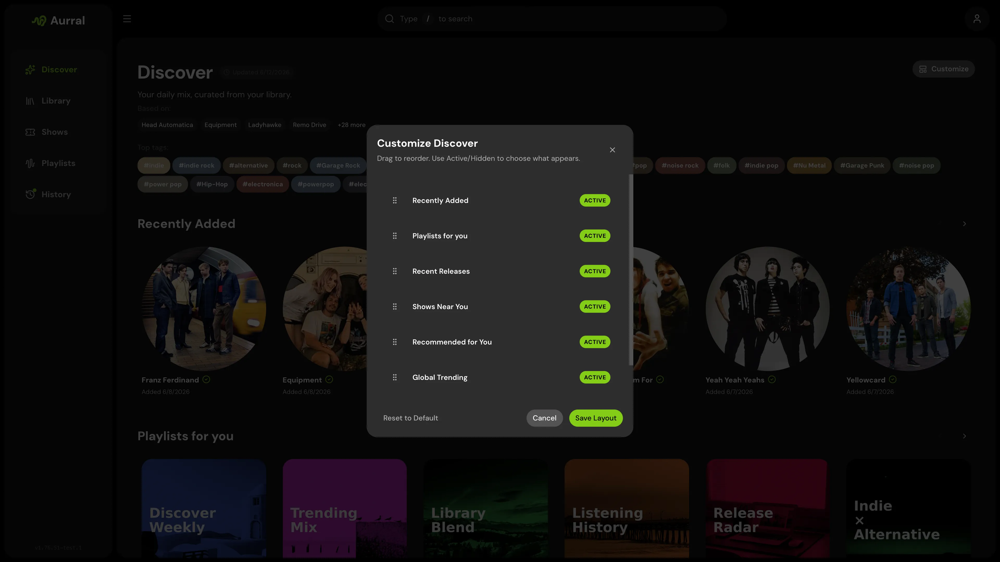

Discover is Aurral's home screen. It brings together personalized recommendations, global trends, tags, recent releases, discover playlists, recently added artists, and nearby shows when Ticketmaster is configured.

Discover is library-aware. Aurral tries to recommend artists that fit your taste while avoiding artists you already have.

## What shapes recommendations

- Your Lidarr library
- Your Last.fm, ListenBrainz, or Koito listening history
- Last.fm tags and similar artists
- Global trending pools
- Recent releases
- Your feedback on recommendations

## Discovery modes

| Mode | Best for |
| --- | --- |
| Safer | Familiar, high-confidence recommendations |
| Balanced | A mix of familiar picks and exploration |
| Deeper | More adventurous recommendations outside the obvious lane |

You can customize which sections appear on your Discover page and reorder them per user.

## Discover playlists

Aurral can generate playlists such as Release Radar from your listening context. These appear in Discover and can be adopted into your Playlists library for downloads and playback.

## Per-user listening history

Each user sets their own listening-history provider in **Profile** — a Last.fm or ListenBrainz username, or a Koito instance URL. This lets a shared Aurral instance serve different people without mixing every preference together.

## Shows

When Ticketmaster is configured, Discover can surface nearby concerts for recommended, trending, and library-adjacent artists.
