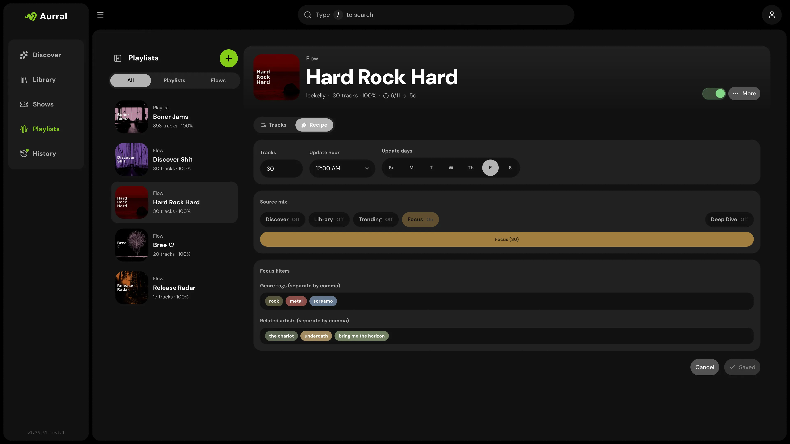

Flows are dynamic playlists. They regenerate on their schedule, download into Aurral's own folder, and can be exposed to Navidrome or Plex.

## How a flow works

A flow has three layers:

1. **Schedule** — when the flow runs
2. **Source mix** — where tracks come from
3. **Focus inputs** — what the Focus source should try to match

## Schedule

- **Tracks** sets the playlist size.
- **Update days** chooses which days the flow may run.
- **Update hour** chooses the hour for those runs.
- A flow only starts generating when it is enabled. A disabled flow saves its settings but will not run.

## Source mix

Source mix controls where tracks come from.

| Source   | Behavior                                                                  |
| -------- | ------------------------------------------------------------------------- |
| Discover | Aurral's recommendation pool; always excludes library artists             |
| Library  | Artists from your library; the only source allowed to use library artists |
| Trending | Broader trending pools; always excludes library artists                   |
| Focus    | Non-library artists that best match your genre tags and related artists   |

The mix slider is shared across enabled sources:

- With all four sources on, it behaves like a four-way mix.
- With two sources on, it collapses into a two-way split.
- With one source on, that source takes 100%.

The counts shown inside the slider are the current track targets per source based on the flow size.

### Source toggles

Turning a source off removes it from the mix entirely. Turning it on adds it back into the shared slider.

### Library behavior

**Library** is the only source allowed to use library artists. **Discover**, **Trending**, and **Focus** always exclude them. Disabling **Library** does not clear your saved focus inputs — it only removes the library-only source from the mix.

## Deep dive

Deep dive changes how far Aurral looks when pulling candidates. **Off** prefers well-known tracks from highly-seeded sources. **On** reaches deeper into less popular catalog, pulling tracks from artists with fewer listeners and lower general availability. It does not change the schedule or source percentages.

## Focus

Focus is a dedicated fourth source. It does not bend Discover, Library, or Trending.

- **Genre tags** tell Focus which genres to target.
- **Related artists** tell Focus which similarity seeds to target.
- If Focus is enabled, at least one genre tag or related artist is required.
- If Focus is disabled, your tags and artists stay saved but are inactive.

### Focus matching behavior

When both genre tags and related artists are present, Focus broadens in this order:

1. Artists related to all entered related artists and matching all tags
2. Artists related to all entered related artists and matching at least one tag
3. Artists related to any entered related artist and matching all tags
4. Artists related to any entered related artist and matching at least one tag
5. Artists related to all entered related artists only
6. Artists related to any entered related artist only
7. Tag-only artists matching all tags
8. Tag-only artists matching at least one tag

### Multiple tags or related artists

Multiple tags prefer overlap first. `acoustic, sad` tries artists matching both before broadening to one-tag matches. Multiple related artists prefer shared similarity first.

### Focus input behavior

Enter multiple tags or artists separated by commas. Entries tokenize when separated by a comma or when the field loses focus. Duplicates are ignored.

## Fallback behavior

Aurral always tries the most specific matches first, then relaxes if it runs out of valid candidates.

1. Fill each enabled source with its own quota
2. For Focus, match the focus request as closely as possible before broadening
3. Keep strict one-song-per-artist diversity across the whole run
4. Redistribute source shortfalls across the other enabled sources
5. Use reserve/replacement candidates if the run still comes up short

Focus does not secretly steer the other sources. You can make highly targeted playlists by weighting Focus heavily or using Focus alone. Fallback still stays inside the enabled sources whenever possible.

## Flow generation behavior

When a flow runs, Aurral:

1. Calculates the track count target
2. Calculates source counts from the current source mix
3. Harvests oversized candidate pools inside each enabled source
4. Builds a dedicated Focus pool if Focus is enabled
5. Picks the primary playlist with a strict one-song-per-artist rule
6. Redistributes any source shortfalls across the other enabled sources
7. Builds a reserve pool from the same run for fast replacements
8. Sends the primary playlist into the download worker

Only flows may generate replacement tracks when downloads fail. See [Playlist imports](/using/playlist-imports/) for static playlist retry behavior.

## Lidarr import list

Each flow can publish a token URL for Lidarr **Custom List** import. Copy it from the flow menu on **Playlists**. See [Lidarr — Import list feeds](/integrations/lidarr/#import-list-feeds).
