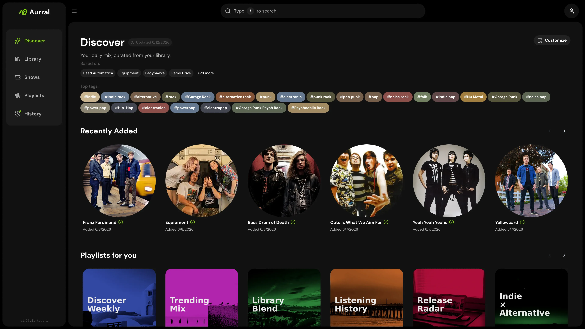
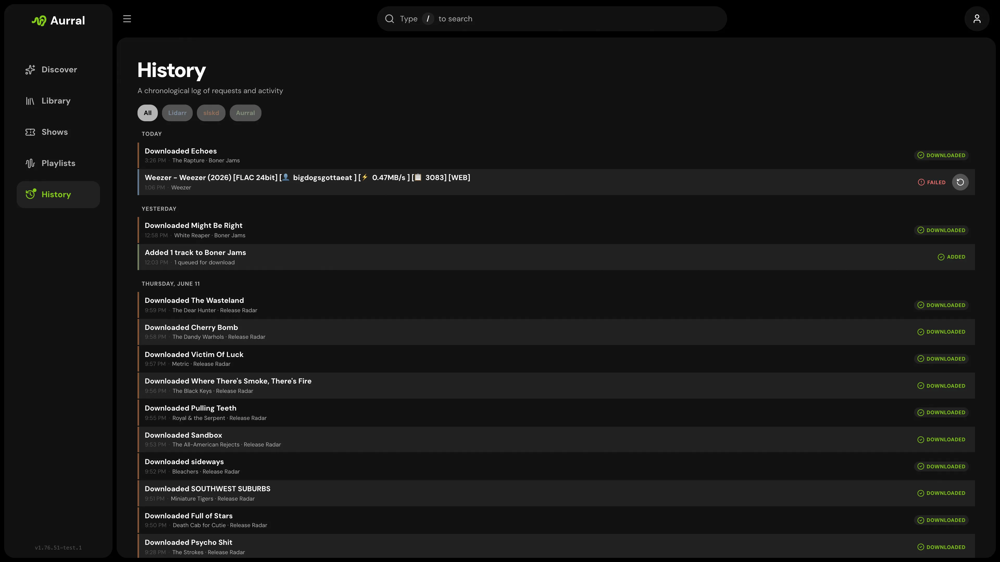
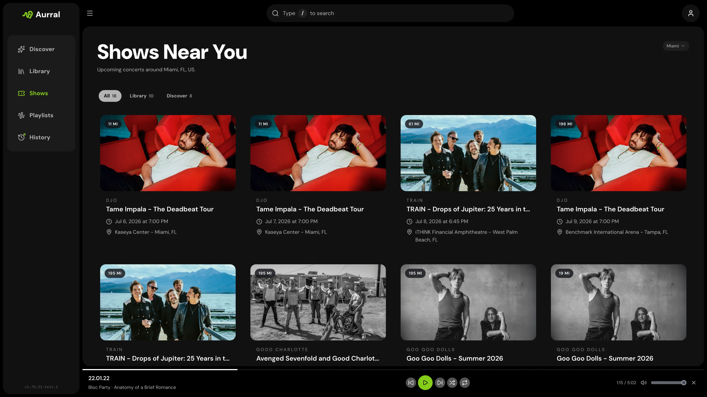
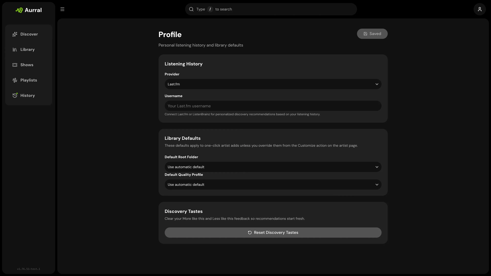
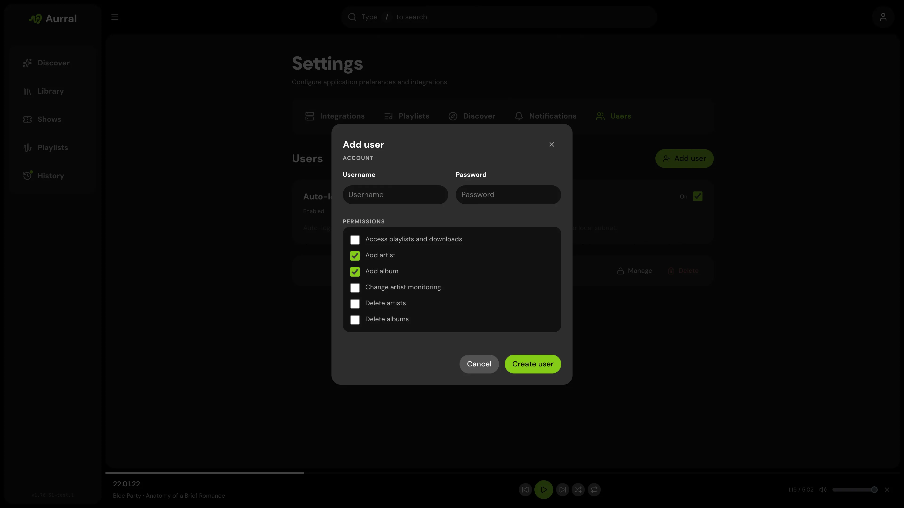

Aurral is the discovery layer for a Lidarr-based music stack: visual, intentional, and connected to the library you already maintain.

## Main sections

### Discover

Home screen for personalized recommendations, global trends, tags, recent releases, discover playlists, recently added artists, and nearby shows. Customize which sections appear and reorder them per user.

### Search

Find artists and albums, preview tracks, inspect library status, and add to Lidarr with your defaults.

### Library

Browse artists already in Lidarr with search, sorting, artwork, monitoring status, and full artist pages.

### Playlists

Scheduled flows, Spotify imports, discover playlists, in-app playback, and download status. Flows regenerate on a schedule; static playlists keep fixed tracklists or sync from Spotify.

### Activity

Queue for active Lidarr requests, download client activity (slskd, yt-dlp, and Usenet), and Aurral playlist jobs. History for the completed and failed timeline.

### Shows

Nearby concerts for artists you care about, when Ticketmaster is configured.

### Profile

Per-user listening history (Last.fm, ListenBrainz, or Koito), Lidarr defaults, and personal preferences.

### Settings

Admin-only configuration, organized into tabs:

| Tab                  | What it covers                                                        |
| -------------------- | --------------------------------------------------------------------- |
| **System**           | Downloads folder, path mappings, general settings, cover art          |
| **Tasks**            | Active and stale worker task management                               |
| **Lidarr**           | Lidarr connection, profiles, tags, library access check               |
| **Indexers**         | Prowlarr connection, indexer management, search priorities            |
| **Download Clients** | yt-dlp, slskd, SABnzbd, NZBGet, source priority, format preferences   |
| **Playback**         | Navidrome and Plex                                                    |
| **Discover**         | Last.fm, Ticketmaster, discovery refresh and mode                     |
| **Connect**          | Gotify and webhooks                                                   |
| **Users**            | Accounts and permissions                                              |

Metadata providers live at **Settings → Metadata Providers** (`/settings/metadata`).
