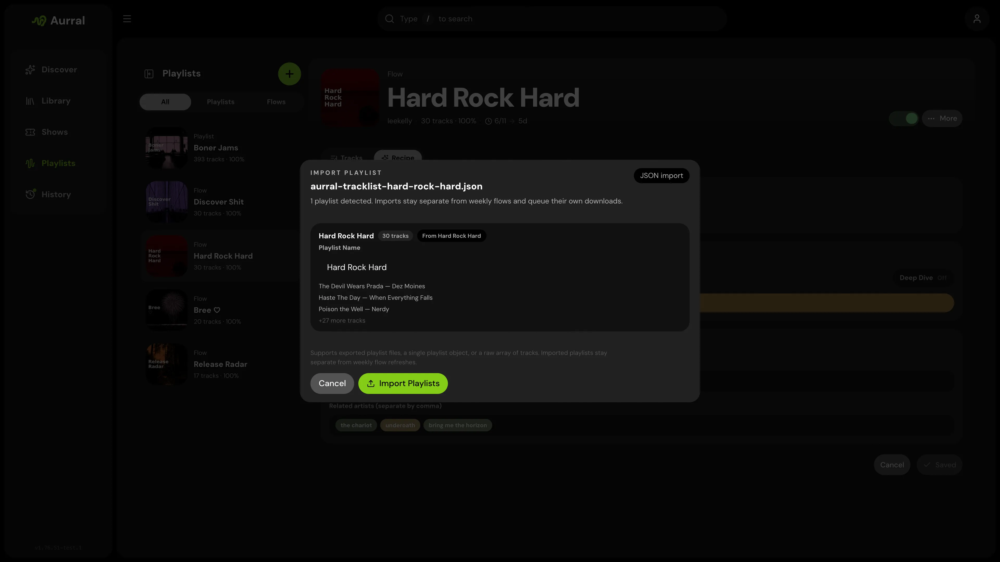

Imported playlists are separate from flows.

- They do not regenerate on a schedule.
- They do not use source mix, focus filters, or deep dive.
- They retry the exact tracklist they were imported with.
- They can reuse completed Aurral tracks or existing Lidarr files when worker settings allow.



## Spotify import

The fastest path from Spotify is the [Spotify import helper](https://aurral.org/aurral-convert.html) on aurral.org, which converts Exportify CSV files into Aurral-ready JSON.

Manual path:

1. Export the playlist from [Exportify](https://exportify.net/)
2. Convert the CSV to JSON with [CSVJSON](https://csvjson.com/csv2json)
3. Import that JSON file in Aurral

Aurral accepts CSVJSON output directly as one playlist and understands Spotify-style keys like `Track Name`, `Artist Name(s)`, and `Album Name`.

## What the importer accepts

The importer accepts these JSON shapes:

1. An exported Aurral playlist file
2. A single playlist object with a `tracks` array
3. A raw array of tracks
4. A bundle object with a `playlists` array
5. A nested `{ "playlist": { ... } }` wrapper

## Required track fields

Each track must include:

- `artistName`
- `trackName`

Accepted aliases:

| Field | Accepted keys |
| --- | --- |
| Artist | `artistName`, `artist`, `artist_name`, `Artist Name(s)` |
| Track | `trackName`, `title`, `name`, `track`, `Track Name` |
| Album (optional) | `albumName`, `album`, `Album Name` |
| Artist ID (optional) | `artistMbid`, `artistId`, `mbid` |

Minimum shape:

```json
{
  "artistName": "Burial",
  "trackName": "Archangel"
}
```

## Accepted JSON examples

### Exported Aurral playlist file

```json
{
  "type": "aurral-static-tracklist",
  "version": 1,
  "exportedAt": "2026-03-25T12:00:00.000Z",
  "name": "Late Night Finds",
  "sourceName": "Friday Flow",
  "sourceFlowId": "abc123",
  "trackCount": 2,
  "tracks": [
    {
      "artistName": "Burial",
      "trackName": "Archangel",
      "albumName": "Untrue",
      "artistMbid": null
    },
    {
      "artistName": "Four Tet",
      "trackName": "Two Thousand and Seventeen",
      "albumName": null,
      "artistMbid": null
    }
  ]
}
```

### Single playlist object

```json
{
  "name": "My Playlist",
  "tracks": [
    { "artistName": "Massive Attack", "trackName": "Teardrop" },
    { "artistName": "Portishead", "trackName": "Roads" }
  ]
}
```

### Raw array of tracks

A top-level array of track objects is treated as one playlist. This is what the CSV converter generates.

```json
[
  { "artistName": "Burial", "trackName": "Archangel" },
  { "artistName": "Air", "trackName": "La Femme d'Argent" }
]
```

### Multi-playlist bundle

```json
{
  "playlists": [
    {
      "name": "Warm",
      "tracks": [{ "artistName": "Bonobo", "trackName": "Kiara" }]
    },
    {
      "name": "Dark",
      "tracks": [{ "artistName": "Burial", "trackName": "Near Dark" }]
    }
  ]
}
```

### Nested playlist wrapper

```json
{
  "playlist": {
    "name": "Imported Set",
    "tracks": [{ "artistName": "Air", "trackName": "La Femme d'Argent" }]
  }
}
```

## Import notes

- A top-level array of track objects is treated as one playlist.
- A top-level array of playlist objects is treated as multiple playlists.
- If an imported playlist name conflicts with an existing playlist, Aurral renames it automatically.
- Imported playlists queue their own downloads and do not affect any flow configuration.
- When existing file reuse succeeds, the imported track is marked complete immediately and is not queued for download.

## Download retries and failure behavior

Imported playlists behave differently from flows when downloads fail:

- Each imported track is queued as its own worker job.
- Retryable failures get an immediate retry with backoff.
- Known non-retryable errors are skipped for immediate retry.
- If a playlist is incomplete and has no pending or downloading jobs, failed tracks are requeued in the periodic incomplete-playlist cycle (about every 15 minutes).
- Imported playlists keep retrying the same original tracklist.
- Only flows may generate replacement tracks.

## Existing file reuse

Aurral keeps every generated playlist entry inside its own playlist folder under `aurral-weekly-flow/<playlist-id>`. When existing file reuse is enabled, that entry can point at a matching completed Aurral or Lidarr file instead of a new slskd download.

| Mode | Behavior |
| --- | --- |
| Download | Always download a new file |
| Reuse existing files | Use a matching completed Aurral or Lidarr file when one is available |

Aurral-global reuse prevents the same imported track from being downloaded again for another playlist. Lidarr-aware reuse requires Aurral to see Lidarr's root directory the same way Lidarr sees it — find this at **Lidarr → Settings → Media Management → Root Folders → Path** (for example `/data/music`).

For slskd handoff, Navidrome playback, and efficient hardlinks, mount the same host folder at `/data` in Aurral, Lidarr, slskd, and Navidrome. See [Shared storage](/getting-started/storage/) and [`docker-compose.example.yml`](https://github.com/lklynet/aurral/blob/main/docker-compose.example.yml).

Configure reuse in **Settings → Playlists**.
